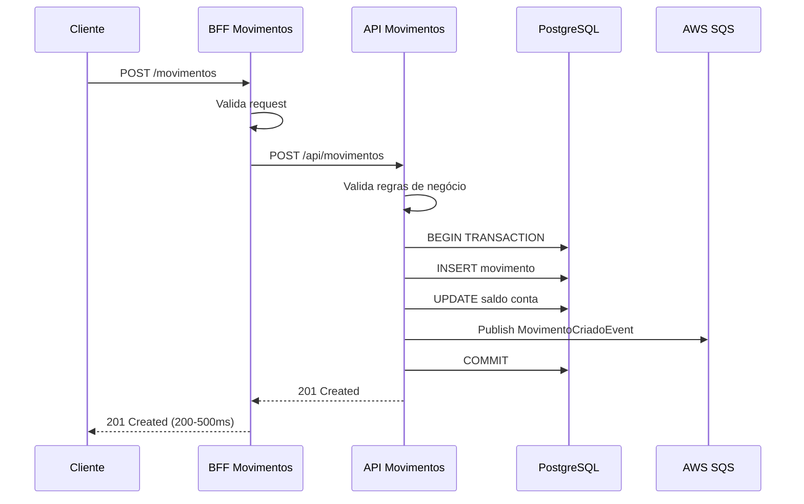
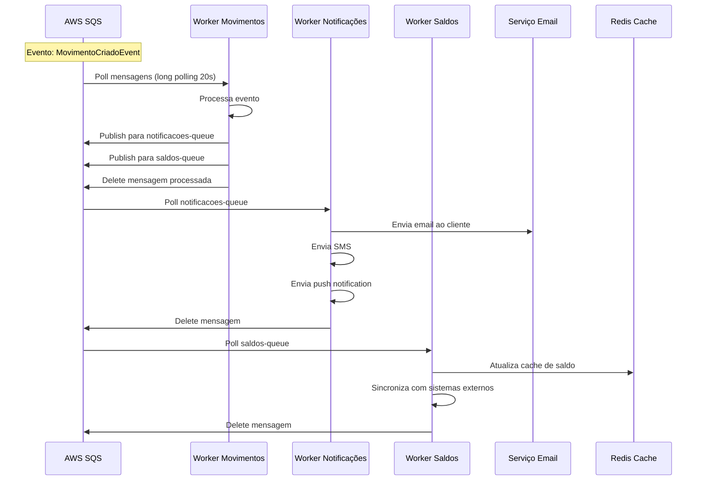

# 🏗️ Arquitetura Detalhada - Sistema de Movimentações Bancárias

## 📋 Índice

1. [Visão Geral da Arquitetura](#visão-geral-da-arquitetura)
2. [Fluxo de Operações](#fluxo-de-operações)
3. [Workers e Processamento Assíncrono](#workers-e-processamento-assíncrono)
4. [Padrões Arquiteturais](#padrões-arquiteturais)
5. [Exemplo Prático Completo](#exemplo-prático-completo)

---

## 🎯 Visão Geral da Arquitetura

### Componentes Principais

```
┌─────────────────────────────────────────────────────────────────────────┐
│                            CAMADA CLIENTE                                │
│                     (Mobile App / Web App / Postman)                     │
└────────────────────────────────┬────────────────────────────────────────┘
                                 │ HTTP/REST
                    ┌────────────▼─────────────┐
                    │   BFF (Backend For       │
                    │      Frontend)           │
                    │  - Agregação de dados    │
                    │  - Validação inicial     │
                    │  - Transformação         │
                    └────────────┬─────────────┘
                                 │ HTTP/REST
                ┌────────────────▼─────────────────┐
                │      API MOVIMENTAÇÕES           │
                │  - Lógica de Negócio             │
                │  - Domain Services               │
                │  - Validações Complexas          │
                │  - Transações                    │
                └────┬──────────────────┬──────────┘
                     │                  │
         ┌───────────▼─────────┐       │
         │   PostgreSQL        │       │
         │   - Contas          │       │
         │   - Movimentos      │       │
         │   - Saldos          │       │
         └─────────────────────┘       │
                                       │ Publish Event
                          ┌────────────▼─────────────┐
                          │      AWS SQS QUEUES      │
                          │                          │
                          │  📬 movimentos-queue     │
                          │  📬 notificacoes-queue   │
                          │  📬 saldos-queue         │
                          └────────────┬─────────────┘
                                       │ Poll Messages
              ┌────────────────────────┼────────────────────────┐
              │                        │                        │
    ┌─────────▼─────────┐   ┌─────────▼─────────┐   ┌─────────▼─────────┐
    │ Worker Movimentos │   │ Worker Notificações│   │  Worker Saldos    │
    │                   │   │                    │   │                   │
    │ - Agregações      │   │ - Envio Email      │   │ - Atualiza Cache  │
    │ - Relatórios      │   │ - Envio SMS        │   │ - Sincroniza      │
    │ - Analytics       │   │ - Push Notif.      │   │   Sistemas        │
    └───────────────────┘   └────────────────────┘   └───────────────────┘
```

---

## 🔄 Fluxo de Operações

### 1️⃣ Fluxo Síncrono (Resposta Imediata)



**Características:**
- ⚡ **Rápido**: 200-500ms
- ✅ **Confiável**: Transação ACID no banco
- 🎯 **Crítico**: Garante integridade dos dados
- 📊 **Resposta**: Cliente recebe confirmação imediata

### 2️⃣ Fluxo Assíncrono (Processamento em Background)



**Características:**
- 🔄 **Eventual**: Processa em segundos/minutos
- 🛡️ **Resiliente**: Retry automático em caso de falha
- 📈 **Escalável**: Múltiplos workers processando
- 🎨 **Flexível**: Fácil adicionar novos processamentos

---

## 🤖 Workers e Processamento Assíncrono

### O que são Workers?

Workers são **serviços de background** que rodam continuamente, fazendo **polling** (consultando) filas de mensagens e processando eventos de forma **assíncrona**.

### Anatomia de um Worker

```csharp
public class MovimentoWorker : BackgroundService
{
    private readonly IAmazonSQS _sqsClient;
    private readonly ILogger<MovimentoWorker> _logger;
    private readonly string _queueUrl;

    protected override async Task ExecuteAsync(CancellationToken stoppingToken)
    {
        _logger.LogInformation("Worker iniciado - aguardando mensagens...");

        while (!stoppingToken.IsCancellationRequested)
        {
            try
            {
                // 1️⃣ POLL: Busca mensagens (long polling - 20s)
                var request = new ReceiveMessageRequest
                {
                    QueueUrl = _queueUrl,
                    MaxNumberOfMessages = 10,
                    WaitTimeSeconds = 20 // Long polling
                };

                var response = await _sqsClient.ReceiveMessageAsync(
                    request, 
                    stoppingToken
                );

                // 2️⃣ PROCESS: Processa cada mensagem
                foreach (var message in response.Messages)
                {
                    await ProcessMessageAsync(message, stoppingToken);
                }
            }
            catch (Exception ex)
            {
                _logger.LogError(ex, "Erro ao processar mensagens");
                await Task.Delay(5000, stoppingToken); // Aguarda antes de tentar novamente
            }
        }
    }

    private async Task ProcessMessageAsync(
        Message message, 
        CancellationToken cancellationToken
    )
    {
        try
        {
            // 3️⃣ DESERIALIZE: Converte JSON para objeto
            var evento = JsonSerializer.Deserialize<MovimentoCriadoEvent>(
                message.Body
            );

            // 4️⃣ BUSINESS LOGIC: Executa lógica de negócio
            await ProcessarMovimento(evento);

            // 5️⃣ DELETE: Remove mensagem da fila (sucesso)
            await _sqsClient.DeleteMessageAsync(
                _queueUrl, 
                message.ReceiptHandle, 
                cancellationToken
            );

            _logger.LogInformation(
                "Mensagem processada com sucesso: {MessageId}", 
                message.MessageId
            );
        }
        catch (Exception ex)
        {
            _logger.LogError(
                ex, 
                "Erro ao processar mensagem {MessageId}", 
                message.MessageId
            );
            // Mensagem NÃO é deletada e volta para a fila
            // após o visibility timeout
        }
    }
}
```

### 🎯 Responsabilidades de Cada Worker

#### **Worker Movimentos**
```
📊 Agregações e Análises
├─ Calcula saldo consolidado do dia
├─ Gera estatísticas de movimentações
├─ Detecta padrões suspeitos (fraude)
└─ Publica eventos para outros workers
```

#### **Worker Notificações**
```
📧 Comunicação com Cliente
├─ Envia email de confirmação
├─ Envia SMS para movimentações > R$ 1000
├─ Envia push notification no app
└─ Registra log de notificações enviadas
```

#### **Worker Saldos**
```
💰 Sincronização e Cache
├─ Atualiza cache Redis de saldos
├─ Sincroniza com sistema legado
├─ Atualiza dashboard de analytics
└─ Gera relatórios consolidados
```

---

## 🏛️ Padrões Arquiteturais

### 1. **Event-Driven Architecture (EDA)**

```
┌─────────────┐         ┌─────────────┐         ┌─────────────┐
│  Publisher  │────────▶│    Queue    │────────▶│  Subscriber │
│   (API)     │ Publish │    (SQS)    │  Poll   │   (Worker)  │
└─────────────┘         └─────────────┘         └─────────────┘
```

**Vantagens:**
- ✅ **Desacoplamento**: Componentes não se conhecem diretamente
- ✅ **Escalabilidade**: Adicione workers sem alterar a API
- ✅ **Resiliência**: Falhas em um componente não afetam outros
- ✅ **Flexibilidade**: Fácil adicionar novos consumidores

### 2. **Command Query Responsibility Segregation (CQRS)**

```
┌──────────────────────────────────────────┐
│              WRITE SIDE                   │
│  (Commands - Alterações de Estado)       │
│                                          │
│  API ──▶ Domain Service ──▶ PostgreSQL  │
│                    │                     │
│                    └────▶ SQS Queue      │
└──────────────────────────────────────────┘

┌──────────────────────────────────────────┐
│              READ SIDE                    │
│  (Queries - Leitura Otimizada)           │
│                                          │
│  BFF ──▶ Cache (Redis) ──▶ PostgreSQL   │
│            ▲                             │
│            │                             │
│      Worker Saldos                       │
└──────────────────────────────────────────┘
```

### 3. **Transactional Outbox Pattern**

```csharp
// Garante que o evento seja publicado APENAS se a transação for bem-sucedida

public async Task<MovimentoResponse> CriarMovimento(MovimentoRequest request)
{
    using var transaction = await _context.Database.BeginTransactionAsync();
    
    try
    {
        // 1️⃣ Salva movimento no banco
        var movimento = await _repository.CriarAsync(request);
        
        // 2️⃣ Atualiza saldo
        await _contaService.AtualizarSaldo(request.ContaId, request.Valor);
        
        // 3️⃣ Salva evento na tabela "outbox"
        var evento = new MovimentoCriadoEvent { /* ... */ };
        await _outboxRepository.SalvarEvento(evento);
        
        // 4️⃣ Commit - tudo ou nada
        await transaction.CommitAsync();
        
        // 5️⃣ APÓS commit, publica na fila
        await _sqsPublisher.PublishAsync(evento);
        
        return movimento;
    }
    catch
    {
        await transaction.RollbackAsync();
        throw;
    }
}
```

---

## 💡 Exemplo Prático Completo

### Cenário: Cliente faz um depósito de R$ 1.000,00

#### **Passo 1: Requisição do Cliente (0ms)**

```http
POST https://api.banco.com/movimentos
Authorization: Bearer {token}
Content-Type: application/json

{
  "contaId": 12345,
  "valor": 1000.00,
  "tipo": "Credito",
  "descricao": "Depósito via PIX"
}
```

#### **Passo 2: BFF Processa (50ms)**

```csharp
// BFF valida e enriquece dados
var request = new MovimentoRequest
{
    ContaId = dto.ContaId,
    Valor = dto.Valor,
    Tipo = TipoMovimento.Credito,
    Descricao = dto.Descricao,
    DataHora = DateTime.UtcNow,
    UsuarioId = GetUsuarioIdFromToken(),
    IpOrigem = HttpContext.Connection.RemoteIpAddress?.ToString()
};

// Envia para API
var response = await _movimentosApiClient.CriarAsync(request);
```

#### **Passo 3: API Processa (200ms)**

```csharp
// API executa lógica de negócio
public async Task<MovimentoResponse> CriarAsync(MovimentoRequest request)
{
    using var transaction = await _context.Database.BeginTransactionAsync();
    
    // 1. Valida conta existe e está ativa
    var conta = await _contaRepository.GetByIdAsync(request.ContaId);
    if (conta == null || !conta.Ativa)
        throw new ContaInvalidaException();
    
    // 2. Valida saldo (se débito)
    if (request.Tipo == TipoMovimento.Debito)
    {
        if (conta.Saldo < request.Valor)
            throw new SaldoInsuficienteException();
    }
    
    // 3. Cria movimento
    var movimento = new Movimento
    {
        ContaId = request.ContaId,
        Valor = request.Valor,
        Tipo = request.Tipo,
        Descricao = request.Descricao,
        DataHora = DateTime.UtcNow,
        SaldoAnterior = conta.Saldo,
        SaldoPosterior = conta.Saldo + request.Valor
    };
    
    await _movimentoRepository.AddAsync(movimento);
    
    // 4. Atualiza saldo
    conta.Saldo += request.Valor;
    await _contaRepository.UpdateAsync(conta);
    
    // 5. Publica evento
    var evento = new MovimentoCriadoEvent
    {
        MovimentoId = movimento.Id,
        ContaId = movimento.ContaId,
        Valor = movimento.Valor,
        Tipo = movimento.Tipo,
        DataHora = movimento.DataHora
    };
    
    await _sqsPublisher.PublishAsync("movimentos-queue", evento);
    
    // 6. Commit
    await transaction.CommitAsync();
    
    return movimento.ToResponse();
}
```

**Resposta para o cliente (250ms total):**

```json
HTTP/1.1 201 Created
Location: /api/movimentos/98765

{
  "id": 98765,
  "contaId": 12345,
  "valor": 1000.00,
  "tipo": "Credito",
  "descricao": "Depósito via PIX",
  "dataHora": "2025-11-08T14:30:00Z",
  "saldoAnterior": 5000.00,
  "saldoPosterior": 6000.00
}
```

#### **Passo 4: Worker Movimentos Processa (3-5s depois)**

```csharp
private async Task ProcessarMovimento(MovimentoCriadoEvent evento)
{
    _logger.LogInformation("Processando movimento {MovimentoId}", evento.MovimentoId);
    
    // 1. Atualiza estatísticas
    await _analyticsService.RegistrarMovimento(evento);
    
    // 2. Detecta fraude (se valor alto ou padrão suspeito)
    if (evento.Valor > 10000)
    {
        await _fraudeService.AnalisarMovimento(evento);
    }
    
    // 3. Publica para outros workers
    if (evento.Valor > 1000)
    {
        await _sqsPublisher.PublishAsync("notificacoes-queue", new
        {
            MovimentoId = evento.MovimentoId,
            TipoNotificacao = "SMS",
            Mensagem = $"Movimentação de R$ {evento.Valor:N2} realizada"
        });
    }
    
    await _sqsPublisher.PublishAsync("saldos-queue", new
    {
        ContaId = evento.ContaId,
        NovoSaldo = evento.SaldoPosterior
    });
}
```

#### **Passo 5: Worker Notificações Processa (5-10s depois)**

```csharp
private async Task EnviarNotificacao(NotificacaoEvent evento)
{
    var conta = await _contaRepository.GetByIdAsync(evento.ContaId);
    
    // Envia SMS via Twilio
    await _twilioClient.SendSmsAsync(
        to: conta.Telefone,
        message: evento.Mensagem
    );
    
    // Envia push notification
    await _firebaseClient.SendPushAsync(
        userId: conta.UsuarioId,
        title: "Nova Movimentação",
        body: evento.Mensagem
    );
    
    _logger.LogInformation("Notificações enviadas para conta {ContaId}", conta.Id);
}
```

#### **Passo 6: Worker Saldos Processa (5-10s depois)**

```csharp
private async Task AtualizarCacheSaldo(SaldoEvent evento)
{
    // Atualiza cache Redis
    await _cache.SetStringAsync(
        key: $"saldo:conta:{evento.ContaId}",
        value: evento.NovoSaldo.ToString("F2"),
        options: new DistributedCacheEntryOptions
        {
            AbsoluteExpirationRelativeToNow = TimeSpan.FromMinutes(30)
        }
    );
    
    // Sincroniza com sistema legado (via HTTP)
    await _sistemaLegadoClient.AtualizarSaldoAsync(
        contaId: evento.ContaId,
        novoSaldo: evento.NovoSaldo
    );
    
    _logger.LogInformation("Cache atualizado para conta {ContaId}", evento.ContaId);
}
```

---

## 📊 Diagrama de Tempo Completo

```
Tempo │ Componente          │ Ação
──────┼─────────────────────┼──────────────────────────────────────
0ms   │ Cliente             │ POST /movimentos
50ms  │ BFF                 │ Valida e enriquece dados
250ms │ API                 │ Processa e salva no banco
250ms │ Cliente             │ ← Recebe 201 Created ✅
251ms │ API                 │ Publica evento na fila SQS
──────┼─────────────────────┼──────────────────────────────────────
3s    │ Worker Movimentos   │ Processa evento (analytics, fraude)
5s    │ Worker Notificações │ Envia SMS e push notification
5s    │ Worker Saldos       │ Atualiza cache Redis
10s   │ Cliente             │ Recebe SMS no celular 📱
──────┼─────────────────────┼──────────────────────────────────────
```

---

## 🎯 Benefícios da Arquitetura

### ⚡ Performance
- **API rápida**: Responde em < 500ms
- **Cliente não espera**: Tarefas lentas rodam em background
- **Cache**: Leituras otimizadas via Redis

### 🛡️ Resiliência
- **Retry automático**: SQS reprocessa mensagens que falharam
- **Isolamento**: Falha em um worker não afeta outros
- **Dead Letter Queue**: Mensagens com erro vão para fila especial

### 📈 Escalabilidade
- **Horizontal**: Adicione mais workers conforme demanda
- **Independente**: Cada componente escala separadamente
- **Auto-scaling**: Workers podem usar EC2 Auto Scaling

### 🔧 Manutenibilidade
- **Separação clara**: Cada worker tem uma responsabilidade
- **Fácil debugging**: Logs específicos por componente
- **Testável**: Workers podem ser testados isoladamente

---

## 🚀 Próximos Passos

1. **Implementar API de Movimentações** com publicação de eventos
2. **Configurar filas SQS** na AWS
3. **Criar Workers** como BackgroundServices
4. **Implementar monitoramento** com CloudWatch
5. **Adicionar testes** de integração com LocalStack

---

**Documentação criada em**: 08/11/2025  
**Versão**: 1.0  
**Autor**: Vitor Moutim